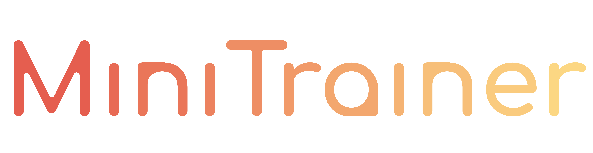

The PyTorch micro framework for training neural networks.

- **Lightweight**: As few lines of code as possible. Easy to use and understand. If you don't call a function, you don't need to know how it works.

- **Plug and play**: The framework is designed to be used with extensions. You can use the extensions provided by the framework or write your own. This provides a lot of flexibility and customization.

- **Templates**: The framework provides 3 levels of templates for starting a new project.
